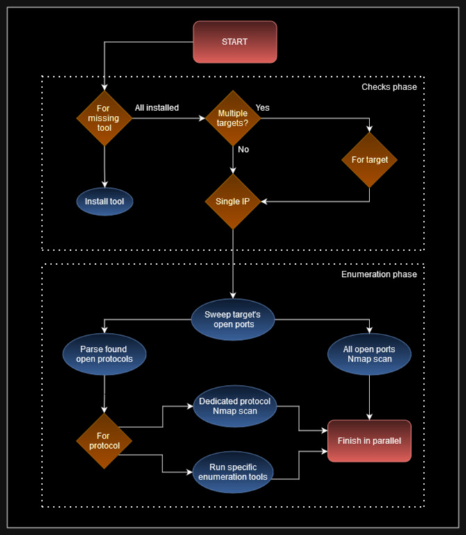

# Enumeraga - Hack your initial scans

[](https://goreportcard.com/report/github.com/0x5ubt13/enumeraga)
[](https://codeclimate.com/github/0x5ubt13/enumeraga/maintainability)
[](https://godoc.org/github.com/0x5ubt13/enumeraga)

[](https://golang.org)

Automatic multiprocess Linux CLI tool that aims for a quick enumeration wrapping pentesting tools. Scan your target in 20 seconds! This is an attempt to develop a rich tool that leverages the nice features Go has to offer. Now available in containerised versions for both infrastructure and cloud scanning!


## Features

- **Fast parallel scanning** - Runs multiple tools concurrently with configurable worker pool (default: 20 concurrent tools)
- **Smart protocol detection** - Groups ports by protocol and runs appropriate enumeration tools
- **Graceful shutdown** - Ctrl+C cleanly terminates all running tools
- **Configurable timeouts** - Prevent long-running tools from blocking scans (default: 10 minutes)
- **Progress tracking** - Real-time progress counter showing completed/total tools
- **Docker support** - Containerised versions for both infrastructure and cloud scanning
- **Cloud scanning** - Supports AWS, Azure, GCP, OCI, AliCloud, and DigitalOcean

## The motivation

Working as pentesters, or playing CTFs, or fiddling around with practice labs, we come across the same initial phases of recon and enumeration over and over again. Or how many times we have to spawn a new clean testing machine and reinstall everything? I thought it would be an amazing opportunity to practice my coding skills if I automated the installation process and the initial tools that I always run in new engagements. Then, after seeing the first results in Bash (if you're curious: [autoEnum](https://github.com/0x5ubt13/autoenum)), I liked what I had done, and I kept adding on more features, until the Bash script grew up so much that I started thinking: "what if I actually use Go and compile this to a binary? Would I be able to pull it off...?" And, well, I'm a sucker for a good challenge if learning is a joyful side effect.

## Flow chart



## Usage

Give `Enumeraga` either a single IP address or a file containing a list of IPs. Sit back, relax, and laugh maniacally while it handles all enumeration for you, going through every open port on your target on your behalf:

```
enumeraga infra -h

                                                      v0.3.3-beta
 __________                                    ______________________
 ___  ____/__________  ________ __________________    |_  ____/__    |
 __  __/  __  __ \  / / /_  __ `__ \  _ \_  ___/_  /| |  / __ __  /| |
 _  /___  _  / / / /_/ /_  / / / / /  __/  /   _  ___ / /_/ / _  ___ |
 /_____/  /_/ /_/\__,_/ /_/ /_/ /_/\___//_/    /_/  |_\____/  /_/  |_|
                        by 0x5ubt13


Usage: enumeraga infra [-bhinqV] [-o value] [-p value] [-r value] [-T value] [-t value]
 -b, --brute        Activate all fuzzing and bruteforcing in the script.
 -h, --help         Display this help and exit.
 -i, --install      Only try to install pre-requisite tools and exit.
 -n, --nmap-only    Only run nmap scans. Skip other tools.
 -o, --output=value
                    Select a different base folder for the output.
                    [/tmp/enumeraga_output]
 -p, --top-ports=value
                    Run port sweep with nmap and the flag --top-ports=<your
                    input>
 -q, --quiet        Don't print the banner and decrease overall verbosity.
 -r, --range=value  Specify a CIDR range to use tools for whole subnets.
 -T, --timeout=value
                    Maximum time in minutes for long-running tools (nikto,
                    dirsearch, etc). Default: 10
 -t, --target=value
                    Specify target single IP / List of IPs file.
 -V, --vv           Flood your terminal with plenty of verbosity!
```

### Examples

```bash
# Basic scan of a single target
sudo enumeraga infra -t 192.168.1.100

# Scan with brute force tools enabled
sudo enumeraga infra -t 192.168.1.100 -b

# Scan with verbose output
sudo enumeraga infra -t 192.168.1.100 -V

# Scan with 5-minute timeout for long-running tools
sudo enumeraga infra -t 192.168.1.100 -T 5

# Scan top 1000 ports only
sudo enumeraga infra -t 192.168.1.100 -p 1000

# Scan a CIDR range
sudo enumeraga infra -t 192.168.1.100 -r 192.168.1.0/24

# Scan multiple targets from a file
sudo enumeraga infra -t targets.txt

# Quiet mode (minimal output)
sudo enumeraga infra -t 192.168.1.100 -q
```

## Installation

### Requirements

- Go 1.23 or later
- Linux (Kali recommended for tool availability)
- Root/sudo privileges (for nmap privileged scans)

### Build from source

```bash
git clone https://github.com/0x5ubt13/enumeraga.git
cd enumeraga
go build -o enumeraga main.go
sudo ./enumeraga infra -h
```

### Quick install (download latest release)

```bash
sudo mkdir -p /opt/enumeraga
sudo curl -L https://github.com/0x5ubt13/enumeraga/releases/latest/download/enumeraga -o /opt/enumeraga/enumeraga
sudo chmod +x /opt/enumeraga/enumeraga
sudo ln -s /opt/enumeraga/enumeraga /usr/bin/enumeraga
enumeraga -h
```

### Containerised version - Infrastructure Scanning

Build and run the infrastructure scanner in a container:

```bash
# Build the image
docker build -t gagarter/enumeraga_infra .

# ...Or use the latest built image on Dockerhub:
docker pull gagarter/enumeraga_infra

# Run against a single target
docker run --network host -v ./output:/tmp/enumeraga_output gagarter/enumeraga_infra -t 192.168.1.99

# Run with bruteforce enabled
docker run --network host -v ./output:/tmp/enumeraga_output gagarter/enumeraga_infra -t 192.168.1.99 -b

# Run against targets from a file
docker run --network host -v ./output:/tmp/enumeraga_output -v ./targets.txt:/targets.txt gagarter/enumeraga_infra -t /targets.txt
```

**Note:** The `--network host` flag is required for nmap scans to work properly.

### Containerised version - Cloud Scanning

Build and run the cloud scanner in a container:

```bash
# Build the image (MUST run from repo root)
docker build -f internal/cloud/Dockerfile -t gagarter/enumeraga_cloud .

# ... Or use the latest built image on Dockerhub:
docker pull gagarter/enumeraga_cloud

# Run against AWS (mount AWS credentials)
docker run -v ~/.aws:/root/.aws -v ./output:/tmp/enumeraga_output gagarter/enumeraga_cloud aws

# Run against Azure (mount Azure credentials)
docker run -v ~/.azure:/root/.azure -v ./output:/tmp/enumeraga_output gagarter/enumeraga_cloud azure

# Run against GCP (mount GCP credentials)
docker run -v ~/.config/gcloud:/root/.config/gcloud -v ./output:/tmp/enumeraga_output gagarter/enumeraga_cloud gcp
```

**Key points for cloud scanning:**
- Mount the appropriate credentials directory for your target cloud provider
- Mount an output directory to persist scan results: `-v ./output:/tmp/enumeraga_output`
- Supports AWS, Azure, GCP, OCI, AliCloud, and DigitalOcean

## Disclaimer

This tool has to run as `root`, and despite my nickname, it's not precisely a subtle tool! Contrarily, it will create a ton of noise. Given its aggressive nature, please ensure you know what you're doing before launching it, and of course double-check you have absolute permission to enumerate your target(s).

## Similar tools out there

I am aware other enumeration tools exist, but this one aims to be very fast and concise. So far by the current testing times, Enumeraga is able to run its core logic in about 20 to 60 seconds per host, depending on the number of ports open.

Enumeraga's bottleneck is clearly identified at the port sweeping phase. Once that's out the way the rest of logic gets triggered almost instantly, grouping up several ports in their respective protocols and targeting protocols for enumeration instead.

If you have new ideas to implement in this tool or have any feedback please reach out!

## Wrapped Tools

### Infrastructure Scanning

| Category | Tools |
|----------|-------|
| **Port Scanning** | Nmap |
| **Web Enumeration** | Nikto, Dirsearch, Ffuf, Gobuster, WPScan, WhatWeb, WafW00f, CeWL |
| **SMB/NetBIOS** | CrackMapExec, SMBMap, Enum4linux-ng, Nmblookup, Nbtscan-unixwiz |
| **LDAP** | Ldapsearch |
| **SNMP** | SNMPWalk, Onesixtyone, Braa |
| **Database** | ODAT (Oracle), Hydra (MySQL brute) |
| **SSH** | SSH-Audit, Hydra |
| **SSL/TLS** | Testssl |
| **Other** | Metasploit, Ident-user-enum, Responder-RunFinger, RPCDump, Rusers, Rwho, Nuclei |
| **Brute Force** | Hydra (FTP, SSH, MySQL, RDP) |

### Cloud Scanning

| Provider | Tools |
|----------|-------|
| **AWS** | ScoutSuite, Prowler, CloudFox |
| **Azure** | ScoutSuite, Prowler |
| **GCP** | ScoutSuite, Prowler |
| **OCI** | ScoutSuite |
| **AliCloud** | ScoutSuite |
| **DigitalOcean** | ScoutSuite |

## Protocols Enumerated

- FTP (20-21)
- SSH (22)
- SMTP (25, 465, 587)
- DNS (53)
- Finger (79)
- HTTP/HTTPS (80, 443, 8080, 8443)
- Kerberos (88)
- POP3/IMAP (110, 143, 993, 995)
- MSRPC (135, 593)
- NetBIOS/SMB (137-139, 445)
- SNMP (161)
- LDAP (389, 636)
- R-Services (512-514)
- Rsync (873)
- NFS (2049)
- MySQL (3306)
- RDP (3389)
- WinRM (5985-5986)
- Webmin/NDMP (10000)

## Development

### Running Tests

```bash
# Quick tests
make test-short

# Full test suite
make test-verbose

# With coverage
make test-coverage

# Linting
golangci-lint run
```

### Project Structure

```
enumeraga/
├── main.go                    # Entry point
├── internal/
│   ├── checks/               # CLI argument parsing
│   ├── commands/             # Tool execution wrappers
│   ├── cloud/                # Cloud scanning logic
│   ├── cloudScanner/         # Cloud provider handlers
│   ├── config/               # Configuration management
│   ├── infra/                # Infrastructure scanning logic
│   ├── portsIterator/        # Protocol-specific handlers
│   ├── scans/                # Nmap wrapper functions
│   ├── types/                # Type definitions
│   └── utils/                # Shared utilities
├── Dockerfile                # Infrastructure container
└── internal/cloud/Dockerfile # Cloud scanning container
```

## The name

Doing a casual search looking for my tool, I found out that the name "autoEnum" was already taken by a tool also written in Bash doing similar things developed years ago, so I decided to give my tool a different name. I thought of this version as the third iteration of the program, being the first one [autoNmap](https://github.com/0x5ubt13/myToolkit/tree/main/autoNmap), and the second one [autoEnum](https://github.com/0x5ubt13/autoenum).

The next name had to be some sort of third iteration. It was quite fun and creative trying to come up with a new name, and after brainstorming several possibilities, I tried Pokemon, but I could not think of cool name for a second "evolution" using "auto" as a prefix. It made sense borrowing from the spell naming convention of the Final Fantasy universe, which also includes a G in the third version of their spells, and so to honour the decision to use Go, and develop the third stage of a script that does automatic enumeration for you, `Enumeraga` was born.

## Contributing

Contributions are welcome! Please feel free to submit a Pull Request. For major changes, please open an issue first to discuss what you would like to change.

## To Do

- [ ] Test thoroughly on various targets
- [ ] Release v1.0
- [ ] Add a flag to pass `vhosts` and functionality to use them
- [ ] Link each wrapped tool on README to their official repos
- [ ] Add more enumeration tools

Happy enumeration!
