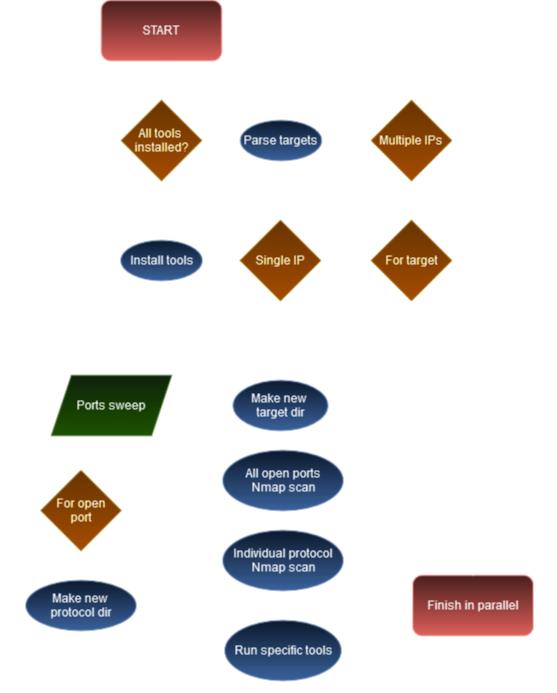

# Enumeraga - Hack your initial scans

Automatic enumeration Golang tool that wraps Linux pentesting tools, ported from [autoEnum](https://github.com/0x5ubt13/autoenum), originally written in Bash. This is an attempt to develop a richer tool that leverages the nice features Go has to offer. Executable binary only 3MB in size! :eyes:

## The motivation

Working as pentesters, or playing CTFs, or fiddling around with practice labs, we come across the same initial phases of recon and enumeration over and over again. I thought it would be an amazing opportunity to practice my coding skills if I automated the initial tools that I always run. Then, after seeing the first results, I liked what I had done and kept adding on more features, until the Bash script grew up so much that I started thinking: "what if I actually use Go and compile this to a binary? Would I be able to pull it off...?" And, well, I'm a sucker for a good challenge if learning is a joyful side effect.

## Flow chart

## Usage

Give `Enumeraga` either a single IP address or a file containing a list of IPs. Sit back, relax, and laugh maniacally while it handles all enumeration for you, going through every open port on your target on your behalf:

    ┌──(root㉿SubtleLabs)-[~]
    └─# enumeraga -h
    
     __________                                    ______________________
     ___  ____/__________  ________ __________________    |_  ____/__    |
     __  __/  __  __ \  / / /_  __ `__ \  _ \_  ___/_  /| |  / __ __  /| |
     _  /___  _  / / / /_/ /_  / / / / /  __/  /   _  ___ / /_/ / _  ___ |
     /_____/  /_/ /_/\__,_/ /_/ /_/ /_/\___//_/    /_/  |_\____/  /_/  |_|
                                by 0x5ubt13                           
    
    
    [*] ---------- Starting Phase 0: running initial checks ----------
    
    [*] Help flag detected. Aborting other checks and printing usage.
    
    Usage: checks [-bDhiqV] [-o value] [-r value] [-t value] [parameters ...]
     -b, --brute        Activate all fuzzing and bruteforcing in the script.
     -h, --help         Display this help and exit.
     -i, --install      Only try to install requisites and exit.
     -o, --output=value
                        Select a different base folder for the output.
                        [/tmp/enumeraga_output]
     -q, --quiet        Don't print the banner and decrease overall verbosity.
     -r, --range=value  Specify a CIDR range to use tools for whole subnets
     -t, --target=value
                        Specify target single IP / List of IPs file.
     -V, --vv           Flood your terminal with plenty of verbosity!
    
    Examples:
     enumeraga -i
     enumeraga -bq -t 10.10.11.230
     enumeraga -V -r 10.129.121.0/24 -t 10.129.121.60
     enumeraga -t targets_file.txt -r 10.10.8.0/24

## Installation

### Executable version

Simply grab the executable and launch it at your leisure! All the necessary tools to run that might be missing in your distro should be directly installed (if `Enumeraga` has your consent), otherwise it will prompt you to install it manually and exit.

This program has been developed in a Kali distro on WSL, so for maximum compatibility I'd suggest it's also run on a Kali VM (for now). I haven't tested it in any other distro yet.

What? You'd like to have a fancy, no-brainer one-liner to try it quick? You've got it! This will download `enumeraga`, put it on `/opt/enumeraga`, make it executable, create a soft link on your path and finally call it with help flag:

    sudo mkdir /opt/enumeraga; sudo curl -L https://github.com/0x5ubt13/enumeraga/releases/download/v0.1.10-beta/enumeraga_v0.1.10-beta -o /opt/enumeraga/enumeraga; sudo chmod +x /opt/enumeraga/enumeraga; sudo ln -s /opt/enumeraga/enumeraga /usr/bin/enumeraga; enumeraga -h

### Containerised version

    Containerised version coming soon!!!

## Disclaimer

This tool has to run as `root`, and despite my nickname, it's not precisely a subtle tool! Contrarily, it will create a ton of noise. Given its aggressive nature, please ensure you know what you're doing before launching it, and of course double-check you have absolute permission to enumerate your target(s).

## Similar tools out there

I am aware other enumeration tools exist, but this one aims to be very fast and concise. So far by the current testing times, Enumeraga is able to run its core logic in about 20 to 60 seconds per host, depending on the number of ports open.

Enumeraga's bottleneck is clearly identified at the port sweeping phase. Once that's out the way the rest of logic gets triggered almost instantly, grouping up several ports in their respective protocols and targeting protocols for enumeration instead.

If you have new ideas to implement in this tool or have any feedback please reach out!

## The name

Doing a casual search looking for my tool, I found out that the name "autoEnum" was already taken by a tool also written in Bash doing similar things developed years ago, so I decided to give my tool a different name. I thought of this version as the third iteration of the program, being the first one [autoNmap](https://github.com/0x5ubt13/myToolkit/tree/main/autoNmap), and the second one [autoEnum](https://github.com/0x5ubt13/autoenum).

The next name had to be some sort of third iteration. It was quite fun and creative trying to come up with a new name, and after brainstorming several possibilities, I tried Pokémon, but I could not think of cool name for a second "evolution" using "auto" as a prefix. It made sense borrowing from the spell naming convention of the Final Fantasy universe, which also includes a G in the third version of their spells, and so to honour the decision to use Go, and develop the third stage of a script that does automatic enumeration for you, `Enumeraga` was born.

## Quality and Learning-As-You-Go

This is my first serious tool developed in Go. At the time of creating this repo, I have been learning Golang for the best part of the last 2 years, and I have been using it to develop solutions for the [Advent of Code](https://adventofcode.com/).

Although I will try my best to adhere to coding conventions, I am still learning as I code, and any kind of contribution towards quality will always be welcome.

## Wrapped tools currently present

- Braa
- CeWL
- CrackMapExec
- Enum4linux-ng
- Ffuf
- Fping
- Gobuster
- Hydra
- Ident-user-enum
- Metasploit
- Nbtscan-unixwiz
- Nikto
- Nmap
- Nmblookup
- Nbtscan-unixwiz
- Ldapsearch
- ODAT
- Onesixtyone
- Responder-RunFinger
- RPCDump
- Rusers
- Rwho
- SMBMap
- SNMPWalk
- SSH-Audit
- WPScan
- WhatWeb
- WafW00f

Besides from the above 29 tools, there are many more included in GNU/Linux doing magic tricks behind the scenes!! (And now Golang's own logic too!)

## Tools yet to implement

- Do you have any other suggestion? Send a PR or a message!

## To Do

---
AutoEnum:

- [x] Implement optional arguments
- [x] Experiment with nice colours
- [x] Implement the use of `printf` instead of `echo`
- [x] Adapt to Google's shell scripting style guide
- [x] Implement sending notifications when tools have finished on background
- [x] Hide many of the notifications behind an optional verbose flag
- [x] Finish the core script

---
Enumeraga:

- [x] Port all of this to Golang
- [x] Rewrite in modules to enable `go get`
- [x] Add cool GitHub badges
- [x] Work on getting maintainability rate up to A
- [ ] Test thoroughly
- [ ] Release v1.0
- [ ] Containerise
- [ ] Improve the way output is presented to terminal
- [ ] Add a flag to pass `vhosts` and functionality to use them
- [ ] Rewrite the `enum4linux-ng` installing function to avoid installing `pip` and dependencies as `root`
- [ ] Link each wrapped tool on README to their official repos
- [ ] Improve README.md to show all protocols the script enumerates
- [ ] Add MOAR enum tools
- [ ] Enumerate all things (legally, please!)

Happy enumeration!
